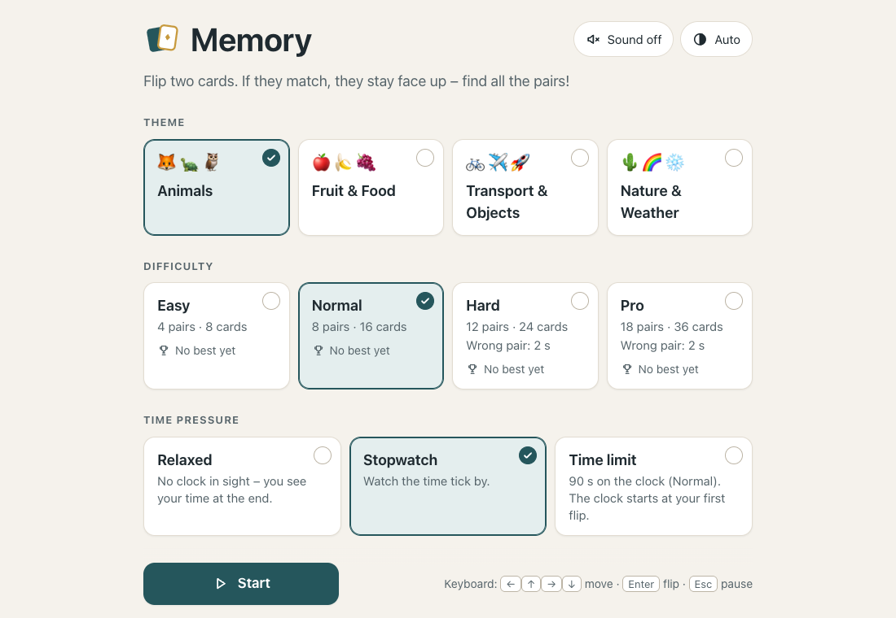

# Memory

A calm, clean memory (pairs) game that runs in the browser – a single HTML file, no dependencies, works offline.

**Play it live: <https://fodorlas.github.io/memoria/>**



## Features

- **Four themes:** Animals · Fruit & Food · Transport & Objects · Nature & Weather. Every card has an emoji and a text label.
- **Four levels:** Easy (4 pairs) · Normal (8) · Hard (12) · Pro (18). On Hard and Pro a wrong pair flips back by itself after 2 seconds.
- **Three time modes:**
  - *Relaxed* – no clock on screen, you see your time at the end
  - *Stopwatch* – a running clock
  - *Time limit* – a countdown (45 / 90 / 150 / 240 s depending on the level)
- **Personal bests** per level, from any time mode.
- **Progress chart** on the result screen: your last 10 finished games on that level, with a table view alongside.
- **Automatic pause** when you switch to another tab or app. The clock starts at your first flip.

## Accessibility & controls

Cards are real `<button>` elements. State is never shown by colour alone (icons, borders and a status line as well), announcements go through an `aria-live` region, text contrast is at least 4.5:1 in light and dark mode, and `prefers-reduced-motion` replaces the card flip with a fade.

| Key | Action |
|---|---|
| Arrow keys | Move between cards |
| Enter / Space | Flip a card |
| Home / End | Start / end of the row (with Ctrl: first / last card) |
| Esc | Pause / resume |

## Run locally

Open `index.html` in a browser, or serve the folder:

```bash
python3 -m http.server 8765
```

Then visit <http://localhost:8765>. Add `?debug=1` to expose `window.__memoria` (game state, `flip(i)`, `warp(ms)`) for testing.

## Data & privacy

Settings, bests and history are stored only in your browser's `localStorage`. Nothing is sent anywhere and there is no tracking. The game still works if storage is blocked; it just won't remember anything.

## Built with AI

Built with an AI assistant (Claude Code). I wrote the requirements, made the design decisions and did the testing.

## Magyarul röviden

Nyugodt, letisztult memóriajáték (párkereső) a böngészőben: egyetlen HTML-fájl, külső függőség nélkül, internet nélkül is fut. Négy téma, négy nehézségi szint, háromféle időmód, szintenkénti rekord és fejlődési grafikon. A felület angol nyelvű.
